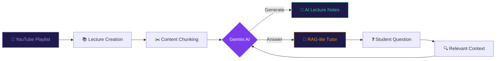
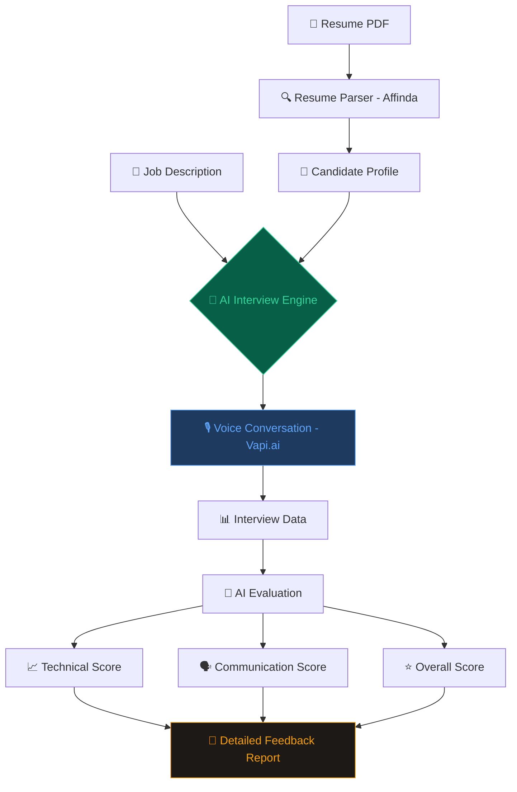
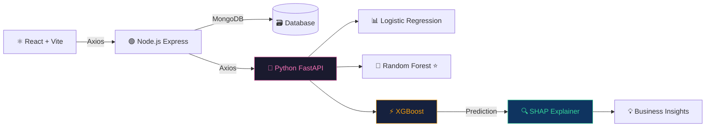
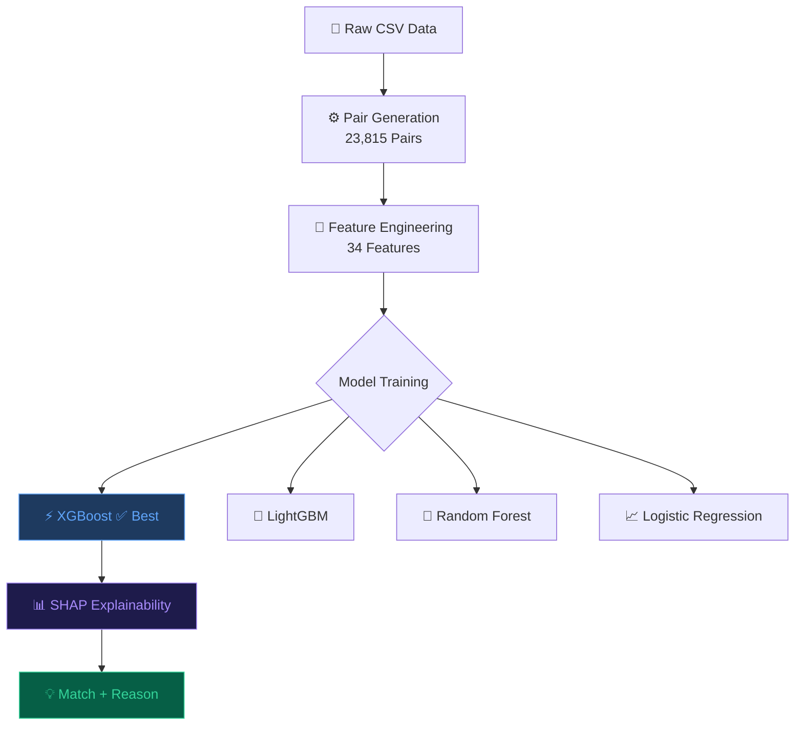
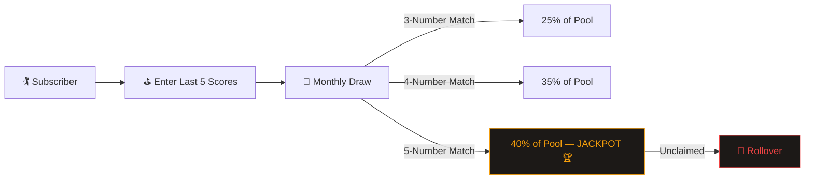
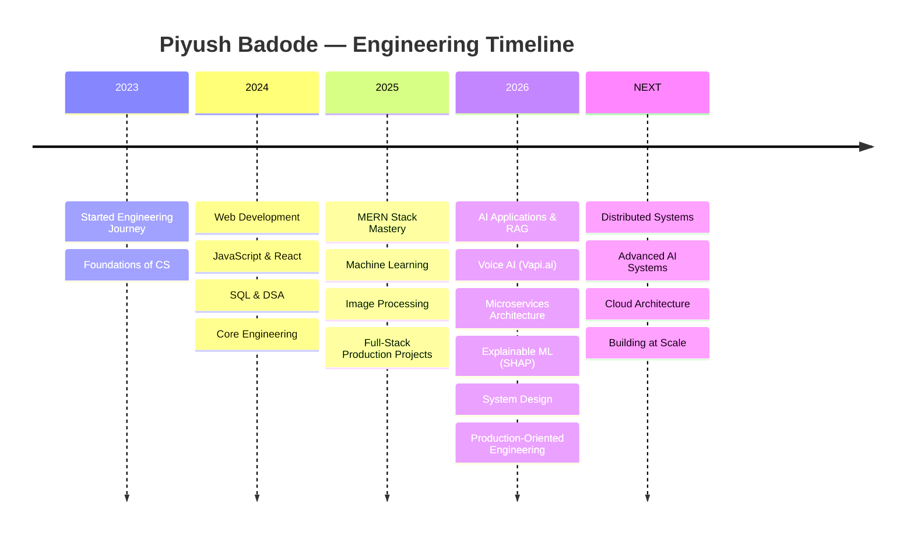

<div align="center">

<!-- ANIMATED HEADER BANNER -->


<!-- ANIMATED TYPING SVG -->
<a href="https://git.io/typing-svg">
  
</a>

<br/><br/>

<!-- ANIMATED PROFILE BADGES -->
<a href="https://github.com/Piyush6046">
  
</a>
&nbsp;
<a href="https://github.com/Piyush6046?tab=repositories">
  
</a>
&nbsp;


<br/><br/>

<!-- ANIMATED DIVIDER -->


</div>

<!-- ABOUT ME SECTION -->
<div align="center">
<h2>
  
  &nbsp;
  <b>ABOUT ME</b>
  &nbsp;
  
</h2>
</div>

```typescript
const piyush: Developer = {
  name        : "Piyush Badode",
  college     : "VJTI Mumbai — Information Technology",
  role        : ["Full-Stack Engineer", "AI/ML Builder", "System Designer"],
  languages   : ["TypeScript", "Python", "JavaScript", "C++", "SQL"],
  currentStack: {
    frontend  : ["React", "Vite", "Redux Toolkit", "Tailwind CSS"],
    backend   : ["Node.js", "Express", "FastAPI", "Flask"],
    database  : ["MongoDB", "MySQL"],
    ai_ml     : ["Gemini", "OpenAI", "Vapi.ai", "XGBoost", "SHAP", "RAG"],
    cloud     : ["Vercel", "Render", "MongoDB Atlas", "Cloudinary"],
    payments  : ["Razorpay"],
  },
  mindset     : "Problem → Architecture → Data Flow → Scale",
  philosophy  : "Build for the problem, not for the technology",
  currentlyExploring: ["Advanced RAG", "Agentic AI", "Distributed Systems", "MLOps", "Redis"],
};
```

<br/>

<div align="center">

> *"I don't build pages. I build systems — where data flows, AI reasons, and scale is a design decision."*

</div>

<br/>

<!-- ANIMATED DIVIDER -->
<div align="center">

</div>

<!-- SKILLS MATRIX -->
<div align="center">
<h2>
  
  &nbsp; ENGINEERING UNIVERSE &nbsp;
  
</h2>
</div>

<div align="center">

| 💻 **Full-Stack** | 🤖 **AI / ML** | 🏗️ **Systems** | 🧩 **CS Fundamentals** |
|:---:|:---:|:---:|:---:|
| React / Vite | Generative AI | Microservices | Data Structures |
| Node.js / Express | RAG Pipelines | FastAPI / Flask | Algorithms & DP |
| MongoDB / MySQL | LLM Applications | API Architecture | DBMS / SQL |
| Redux Toolkit | Gemini / OpenAI | Database Design | OOP Principles |
| JWT / Cookies | Vapi.ai (Voice AI) | Caching Strategies | OS / CN |
| Razorpay | XGBoost / RF / LR | Webhooks | System Design |
| Cloudinary | SHAP Explainability | Authentication | Problem Solving |
| REST API Design | Scikit-learn | Deployment Pipelines | Software Engineering |

</div>

<br/>

<!-- ANIMATED DIVIDER -->
<div align="center">

</div>

<!-- TECHNOLOGY ARSENAL -->
<div align="center">
<h2>
  
  &nbsp; TECHNOLOGY ARSENAL &nbsp;
  
</h2>

<h4>⚡ Languages</h4>


<br/><br/>

<h4>🎨 Frontend</h4>


<br/><br/>

<h4>⚙️ Backend</h4>


<br/><br/>

<h4>🗄️ Database & Cloud</h4>


<br/><br/>

<h4>🤖 AI / ML</h4>


<br/><br/>

<h4>🔧 Tools</h4>


</div>

<br/>

<!-- ANIMATED DIVIDER -->
<div align="center">

</div>

<!-- FEATURED PROJECTS -->
<div align="center">
<h2>
  
  &nbsp; FEATURED PROJECTS &nbsp;
  
</h2>
</div>

---

<details open>
<summary>
  <h3>
    
  </h3>
</summary>

<br/>

> **AI-Powered MERN Learning Management System** — Full-stack LMS with AI-generated lecture notes, AI tutor, YouTube learning workflows & payment infrastructure.

<div align="center">



</div>

**🔐 Payment Flow:** `Client → Create Order → Backend → Razorpay → HMAC-SHA256 Signature Verification → Confirmed`

**📦 Data Design:** Compound index `(userId, courseId)` prevents duplicate course progress records.

| Layer | Technology |
|---|---|
| Frontend | React + Vite |
| Backend | Node.js + Express |
| Auth | JWT + httpOnly Cookies |
| AI | Gemini + RAG-lite |
| Payment | Razorpay + Server-side Verification |
| Storage | MongoDB + Cloudinary |
| Deploy | Vercel + Render + MongoDB Atlas |

<div align="center">


</div>

</details>

---

<details>
<summary>
  <h3>
    
  </h3>
</summary>

<br/>

> **AI-Powered Student Ecosystem** — One platform for campus life, academics, career prep and student services with a **voice-driven AI mock interviewer** at the heart.

<div align="center">



</div>

**🏫 Campus Ecosystem Modules:**

| Module | Purpose |
|---|---|
| 🎤 AI Mock Interviewer | Voice-to-voice placement prep with resume-aware questions |
| 🏠 Hostel Management | Campus accommodation |
| 🍱 Food Discovery | Canteen/food services |
| 🤝 Mentorship | Senior/alumni connections |
| 📚 Marketplace | Student book exchange |
| 📊 Pointer Helper | SGPA/CGPA + target prediction |
| 🔐 Admin Panel | Platform management |

<div align="center">


</div>

</details>

---

<details>
<summary>
  <h3>
    
  </h3>
</summary>

<br/>

> **AI-Powered Telecom Customer Retention Platform** — Full-stack SaaS that predicts churn using ML ensemble models and converts predictions into explainable retention decisions via SHAP.

<div align="center">



</div>

**🤖 ML Model Leaderboard:**

| Model | ROC-AUC | F1 | Precision | Recall |
|---|---|---|---|---|
| ⭐ Random Forest | **0.85** | **0.65** | **0.56** | **0.78** |
| Logistic Regression | 0.86 | 0.64 | 0.52 | 0.84 |
| XGBoost | 0.85 | 0.63 | 0.55 | 0.75 |

**🔬 Explainable AI — Instead of just `Churn = 82%`, the system answers WHY:**

```
Contract Duration    ─────────────────► HIGH RISK   (+++)
Monthly Charges      ──────────────►   RISK         ( ++ )
Tenure               ◄────────────      PROTECTION  ( -- )
Support Services     ◄───────────       PROTECTION  ( -- )
```

<div align="center">


</div>

</details>

---

<details>
<summary>
  <h3>
    
  </h3>
</summary>

<br/>

> **Intelligent Import–Export Matchmaking** — ML pipeline that generates 23,815 exporter-importer pairs, engineers 34 features, and produces explainable match scores using XGBoost + SHAP.

<div align="center">



</div>

**🏆 Best Model — XGBoost:**

```
ROC-AUC       →  0.9802   🔥
Accuracy      →  97.63%
Precision     →  97.96%
Recall        →  99.55%
F1 Score      →  0.9875
5-Fold AUC    →  0.9755 ± 0.0047
```

**🔬 Feature Engineering covers:** capacity ratio · geographic alignment · trade corridors · logistics compatibility · regulatory alignment · payment terms · hiring signals · tariff exposure · geopolitical risk · war risk

**⚙️ Architecture:** `React → Node.js API → Feature Builder → Python Flask ML → XGBoost + SHAP → Match + Explanation`

<div align="center">


</div>

</details>

---

<details>
<summary>
  <h3>
    
  </h3>
</summary>

<br/>

> **Web Application Vulnerability Assessment & Penetration Testing** — Looking at applications not just as *"How do I build it?"* but *"How can this system fail, and how do I protect it?"*

**Security Domains Covered:**

| Domain | Focus Area |
|---|---|
| 🔐 Authentication | Access control, session management |
| 🔑 Authorization | Privilege escalation, role violations |
| 💉 Injection | SQLi, XSS, command injection |
| 🔍 Input Validation | Boundary conditions, type coercion |
| 🛡️ HMAC/Signature | Cryptographic verification |

</details>

---

<details>
<summary>
  <h3>
    
  </h3>
</summary>

<br/>

> **Subscription + Golf Scores + Monthly Draw + Charity + Admin** — Full-stack product specification engineering a complex charity lottery system with golf handicap logic.

**💰 Prize Distribution System:**



**Admin Capabilities:** Users · Subscriptions · Draw Config · Draw Simulation · Charity Management · Winner Verification · Payouts · Analytics

</details>

<br/>

<!-- ANIMATED DIVIDER -->
<div align="center">

</div>

<!-- OTHER BUILDS TABLE -->
<div align="center">
<h2>
  
  &nbsp; OTHER BUILDS &nbsp;
  
</h2>
</div>

<div align="center">

| # | Project | Focus | Stack |
|:---:|---|---|---|
| 🎮 | **Quiz App** | Interactive quiz platform | HTML / CSS / JS |
| 📚 | **VJTI Books** | Student book platform | JavaScript |
| 🎬 | **Movie Management** | Movie/show booking & billing | MySQL |
| 📖 | **Online Library** | Library management system | Web |
| 🧮 | **SGPA Calculator** | Academic grade predictor | TypeScript |
| 🖼️ | **Image Denoising** | Image processing / ML | Python |
| 🎮 | **GameZone** | Browser gaming platform | HTML |
| 🌐 | **Portfolio** | Personal portfolio | HTML / CSS |

</div>

<br/>

<!-- ANIMATED DIVIDER -->
<div align="center">

</div>

<!-- ENGINEERING PRINCIPLES -->
<div align="center">
<h2>
  
  &nbsp; ENGINEERING PRINCIPLES &nbsp;
  
</h2>
</div>

<div align="center">

| Principle | Description |
|:---:|---|
| 🎯 **Problem First** | `What is the problem?` always precedes `What technology should I use?` |
| 🧱 **Separation of Concerns** | Frontend ↔ API Layer ↔ Business Logic ↔ Database ↔ AI/ML Services |
| 🔬 **Explainable AI** | `Prediction + Reason + Evidence` > `Prediction only` |
| 🔐 **Beyond Happy Path** | Auth failures · payment verification · API fallbacks · model failures · scale |
| 📐 **Data-Driven Design** | Schema, indexing, and compound constraints are first-class decisions |
| 🏗️ **Build for Scale** | Every design decision considers: *What happens when the system grows?* |

</div>

<br/>

```text
 IDEA → PROBLEM → REQUIREMENTS → ARCHITECTURE → [FRONTEND · BACKEND · DATA/AI] → TEST → DEPLOY → SCALE
```

<br/>

<!-- ANIMATED DIVIDER -->
<div align="center">

</div>

<!-- DEVELOPER JOURNEY -->
<div align="center">
<h2>
  
  &nbsp; DEVELOPER JOURNEY &nbsp;
  
</h2>
</div>



<br/>

<!-- ANIMATED DIVIDER -->
<div align="center">

</div>

<!-- GITHUB ANALYTICS -->
<div align="center">
<h2>
  
  &nbsp; GITHUB ANALYTICS &nbsp;
  
</h2>
</div>

<div align="center">


&nbsp;&nbsp;


</div>

<br/>

<div align="center">

</div>

<br/>

<div align="center">

</div>

<br/>

<!-- ANIMATED DIVIDER -->
<div align="center">

</div>

<!-- CONTRIBUTION SNAKE -->
<div align="center">
<h2>
  
  &nbsp; CONTRIBUTION ACTIVITY &nbsp;
  
</h2>

<picture>
  <source media="(prefers-color-scheme: dark)" srcset="https://raw.githubusercontent.com/Piyush6046/Piyush6046/output/github-contribution-grid-snake-dark.svg"/>
  <source media="(prefers-color-scheme: light)" srcset="https://raw.githubusercontent.com/Piyush6046/Piyush6046/output/github-contribution-grid-snake.svg"/>
  
</picture>

</div>

<br/>

<!-- ANIMATED DIVIDER -->
<div align="center">

</div>

<!-- CURRENTLY EXPLORING -->
<div align="center">
<h2>
  
  &nbsp; CURRENTLY EXPLORING &nbsp;
  
</h2>
</div>

<div align="center">

```
┌────────────────────────────────────────────────────────────┐
│               ⚡  NEXT LEVEL ENGINEERING  ⚡               │
├──────────────────────┬─────────────────────────────────────┤
│  🧠 Advanced RAG     │  Building smarter retrieval systems  │
│  🤖 Agentic AI       │  Multi-step autonomous LLM agents    │
│  🏗️ Distributed Sys │  CAP theorem, consistency patterns   │
│  ⚡ Redis & Caching  │  Pub/sub, session, rate limiting     │
│  ☁️ Cloud Arch       │  IaC, serverless, edge computing     │
│  🔐 App Security     │  Threat modeling, secure SDLC        │
│  📊 MLOps            │  Model versioning, drift detection   │
│  🐳 Docker & K8s     │  Container orchestration at scale    │
└──────────────────────┴─────────────────────────────────────┘
```

</div>

<br/>

<!-- ANIMATED DIVIDER -->
<div align="center">

</div>

<!-- FEATURED REPOS -->
<div align="center">
<h2>
  
  &nbsp; FEATURED REPOSITORIES &nbsp;
  
</h2>
</div>

<div align="center">

<a href="https://github.com/Piyush6046/UniBuddy-Deployment">
  
</a>
&nbsp;
<a href="https://github.com/Piyush6046/InstructoPlus">
  
</a>

<br/><br/>

<a href="https://github.com/Piyush6046/TeleRetain">
  
</a>
&nbsp;
<a href="https://github.com/Piyush6046/tradeplus-ai">
  
</a>

<br/><br/>

<a href="https://github.com/Piyush6046/VAPT">
  
</a>

</div>

<br/>

<!-- ANIMATED DIVIDER -->
<div align="center">

</div>

<!-- CONNECT -->
<div align="center">
<h2>
  
  &nbsp; LET'S CONNECT &nbsp;
  
</h2>

<a href="https://github.com/Piyush6046">
  
</a>

<br/><br/>


<br/>

**Thanks for visiting — and if something here resonated, leave a ⭐ on a repo that helped you.**

<br/>

<!-- ANIMATED FOOTER -->


</div>
