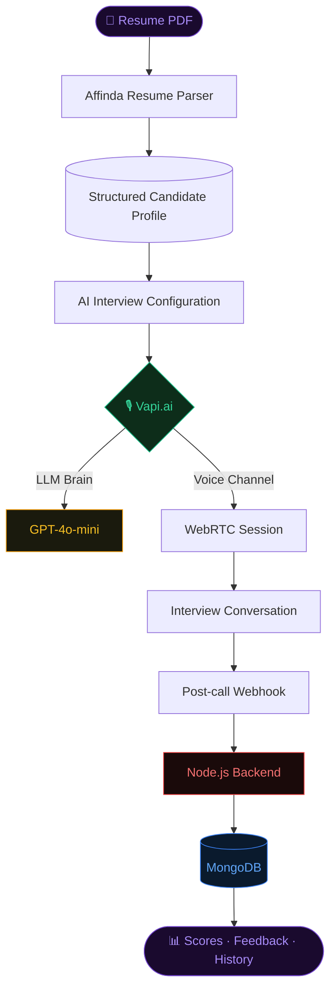
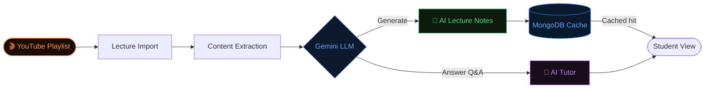
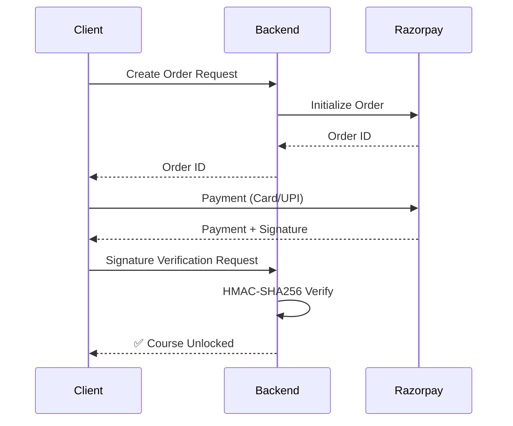
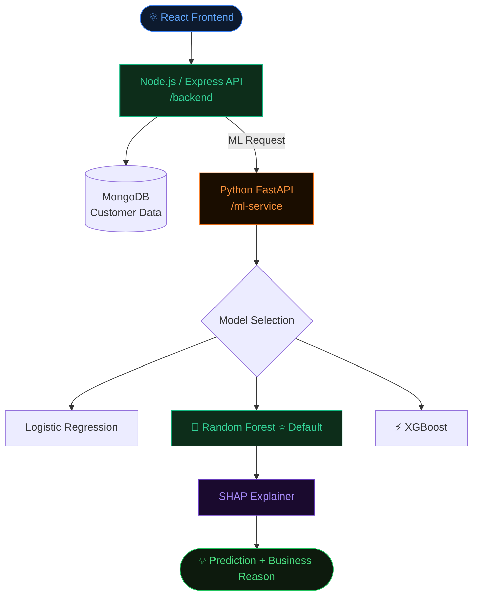
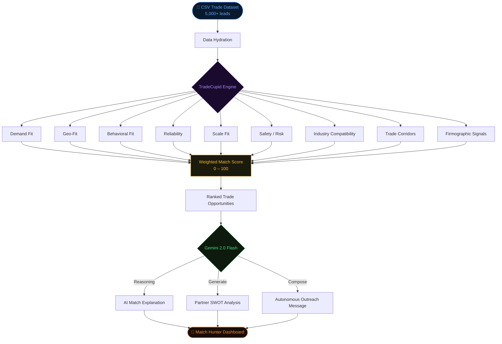
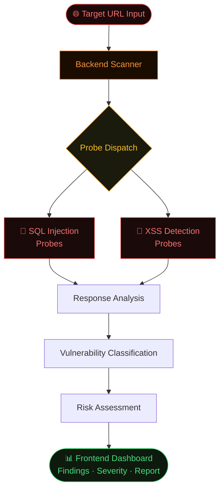

<div align="center">


<a href="https://git.io/typing-svg">
  
</a>

<br/><br/>

[](https://github.com/Piyush6046)
&nbsp;
[](https://www.linkedin.com/in/piyush-badode-058a9b291/)
&nbsp;
[](https://unibuddy-frontend.netlify.app/home)
&nbsp;
[](https://github.com/Piyush6046)

</div>

---

## `$ whoami`

```typescript
const piyush = {
  education   : "Information Technology · VJTI Mumbai",
  building    : ["full-stack systems", "AI-powered apps", "intelligent matching"],
  aiStack     : ["Gemini 2.0", "GPT-4o-mini", "Vapi.ai", "RAG-lite", "SHAP"],
  backendStack: ["Node.js", "Express", "FastAPI", "MongoDB", "JWT"],
  exploring   : ["agentic AI", "advanced RAG", "system design", "MLOps"],
  languages   : ["TypeScript", "JavaScript", "Python", "C++", "SQL"],
  currently   : "integrating AI into full-stack systems that solve real problems",
};
```

> Five projects. Five engineering dimensions. One trajectory: **software systems → intelligent systems.**

---

## What I Build

<div align="center">

| 🖥️ Full-Stack Systems | 🤖 AI / GenAI Applications | ⚙️ Backend & Data |
|:---:|:---:|:---:|
| MERN applications | LLM-powered workflows | REST API design |
| React + TypeScript UIs | Voice AI (Vapi.ai + WebRTC) | MongoDB · MySQL |
| SaaS-style dashboards | Resume parsing pipelines | JWT · httpOnly cookies |
| Authentication systems | RAG-lite & contextual AI | Payment verification |
| Real-time features | AI interview & tutor systems | Microservice architecture |
| Deployment pipelines | Custom scoring/ranking engines | Data modelling & indexing |

</div>

---

## Featured Systems

---

### `01` · UniBuddy — AI-Powered Student Ecosystem

<div align="center">

[](https://github.com/Piyush6046/UniBuddy-Deployment)
&nbsp;
[](https://unibuddy-frontend.netlify.app/home)
&nbsp;


</div>

A campus platform where the real challenge was building an **end-to-end AI mock interview system** — resume parsing → voice conversation → LLM evaluation → scored feedback — all persisted and replayable.

<details>
<summary><b>⚡ Architecture — AI Mock Interview Pipeline</b></summary>

<br/>



</details>

<details>
<summary><b>🏫 Platform Modules</b></summary>

<br/>

| Module | Description |
|---|---|
| 🎤 AI Mock Interviewer | Voice-based · Resume-aware · LLM-evaluated |
| 📊 Grade Analytics | SGPA / CGPA calculation and tracking |
| 📚 Book Marketplace | Buy / sell campus books |
| 💬 Community Chat | Campus-wide messaging |
| 👤 Profile Management | Student identity and interview history |
| 🔐 Admin Panel | Platform oversight and management |

</details>

**Engineering decisions worth noting:**

- Webhook-driven post-call processing — interview is async, evaluation fires server-side after Vapi callback
- Score persistence in MongoDB — not ephemeral, full interview history available
- Resume parsing fully decoupled from interview session

**Stack:** `React` · `TypeScript` · `Tailwind CSS` · `Redux Toolkit` · `Node.js` · `Express` · `MongoDB` · `Vapi.ai` · `GPT-4o-mini` · `Affinda` · `WebRTC`

---

### `02` · InstructoPlus — AI-Powered Learning Management System

<div align="center">

[](https://github.com/Piyush6046/InstructoPlus)
&nbsp;


</div>

A MERN LMS where educators import YouTube playlists as course content and Gemini generates lecture notes on demand. The challenge was combining AI content generation, server-side payment verification, and progress persistence in one coherent system.

<details>
<summary><b>🤖 AI Content Pipeline</b></summary>

<br/>



</details>

<details>
<summary><b>💳 Payment Verification Flow</b></summary>

<br/>



> Server-side verification — the backend validates the HMAC signature before granting course access. Client trust is never assumed.

</details>

<details>
<summary><b>📦 Data Design</b></summary>

<br/>

Course progress uses a compound uniqueness constraint on `(userId, courseId)` — preventing duplicate progress documents while enabling efficient per-student queries at any scale.

</details>

**Deployment:** `Vercel` (frontend) · `Render` (backend) · `MongoDB Atlas`

**Stack:** `React` · `Node.js` · `Express` · `MongoDB` · `Google Gemini` · `JWT` · `Cloudinary` · `Razorpay`

---

### `03` · TeleRetain — Churn Prediction & Retention Platform

<div align="center">

[](https://github.com/Piyush6046/TeleRetain)
&nbsp;


</div>

A monorepo platform putting ML into a backend context — not just training a model, but building a system where predictions flow from model to dashboard to actionable business decisions.

<details>
<summary><b>🏗️ Monorepo Service Architecture</b></summary>

<br/>



</details>

<details>
<summary><b>📊 Model Comparison</b></summary>

<br/>

| Model | ROC-AUC | F1 | Note |
|---|---|---|---|
| Logistic Regression | 0.86 | 0.64 | Baseline |
| **Random Forest** ⭐ | **0.85** | **0.65** | **Default · Best F1** |
| XGBoost | 0.85 | 0.63 | Alternative |

The ML service returns a SHAP-based explanation alongside each prediction — so the business understands *why* a customer is at risk, not just that they are.

</details>

**Stack:** `React` · `Node.js` · `Express` · `MongoDB` · `Python` · `FastAPI` · `XGBoost` · `Scikit-learn` · `SHAP`

---

### `04` · TradePlus AI — Intelligent B2B Trade Matchmaking

<div align="center">

[](https://github.com/Piyush6046/tradeplus-ai)
&nbsp;


</div>

A full-stack B2B trade matchmaking platform where the core intelligence is **TradeCupid** — a custom 9-dimensional weighted scoring engine (prototyped in Python, implemented in Node.js) that ranks trade opportunities across a dataset of 5,000+ importers/exporters.

<details>
<summary><b>⚙️ TradeCupid Matching Engine</b></summary>

<br/>



</details>

<details>
<summary><b>🌐 Platform Features</b></summary>

<br/>

| Feature | Description |
|---|---|
| 🎯 Match Hunter | Discovery dashboard with ranked trade opportunities |
| ⚙️ TradeCupid Engine | Custom 9-dimensional weighted scoring |
| 🧠 AI Reasoning | Gemini-powered match explanations + partner insights |
| 🔬 Algorithm Lab | Interactive visualization of scoring vectors and AI reasoning |
| 📩 Autonomous Outreach | AI-generated first-contact messages on interest expressed |
| 📅 Trade Calendar | Scheduling and interaction tracking |
| 🎥 Video Conferencing | Jitsi-based in-platform video calls |
| 💬 AI Chatbot | Trade-related AI assistant |

</details>

**What makes it interesting:** The scoring is transparent and inspectable — the Algorithm Lab UI shows exactly which signals drove a match score and why. Intelligence without the black box.

**Stack:** `React` · `Node.js` · `Express` · `MongoDB` · `Gemini 2.0 Flash` · `Framer Motion` · `Python` (prototype) · `Jitsi`

---

### `05` · VAPT — Web Application Vulnerability Scanner

<div align="center">

[](https://github.com/Piyush6046/VAPT)
&nbsp;


</div>

A full-stack vulnerability assessment tool — frontend dashboard + backend scanning system — that scans live target URLs for web application vulnerabilities including SQL injection and XSS.

<details>
<summary><b>🛡️ Scanning Architecture</b></summary>

<br/>



</details>

This project represents a different engineering axis — thinking about systems adversarially: not just *"does this work?"* but *"how can this break, and what does that expose?"*

**Stack:** `TypeScript` · `Full-stack frontend + backend scanning system`

---

## AI / GenAI

<div align="center">

### Built & Shipped

| Capability | Project |
|---|---|
| LLM integration — Gemini 2.0 Flash, GPT-4o-mini | TradePlus · InstructoPlus · UniBuddy |
| Voice AI — Vapi.ai + WebRTC voice sessions | UniBuddy AI Interviewer |
| Resume parsing — Affinda | UniBuddy |
| RAG-lite (context-injected LLM Q&A) | InstructoPlus AI Tutor |
| Webhook-driven async AI workflows | UniBuddy post-call processing |
| Autonomous AI output — outreach, SWOT, insights | TradePlus AI |
| Custom ranking / scoring engine | TradePlus TradeCupid |
| Explainable ML — SHAP feature importance | TeleRetain |
| AI content caching — no redundant LLM calls | InstructoPlus |

### Exploring

`Advanced RAG` · `Chunking + Embeddings + Vector Search` · `Agentic AI` · `Tool-calling` · `LangChain` · `MLOps` · `Model deployment`

</div>

---

## Tech Stack

<div align="center">

### Languages


### Frontend


### Backend


### Databases & Cloud


### Tools


</div>

<br/>

<div align="center">

| Layer | Technologies |
|---|---|
| AI / GenAI | `Gemini 2.0 Flash` · `GPT-4o-mini` · `Vapi.ai` · `Affinda` |
| ML / Data | `XGBoost` · `Scikit-learn` · `SHAP` · `Pandas` |
| Auth & Payments | `JWT` · `httpOnly Cookies` · `Razorpay` · `HMAC-SHA256` |
| Media & Infra | `Cloudinary` · `Render` · `MongoDB Atlas` · `Jitsi` |

</div>

</div>

## GitHub Activity

<div align="center">


&nbsp;


<br/><br/>


<br/><br/>


</div>

<br/>

<div align="center">

<picture>
  <source media="(prefers-color-scheme: dark)" srcset="https://raw.githubusercontent.com/Piyush6046/Piyush6046/output/github-contribution-grid-snake-dark.svg"/>
  <source media="(prefers-color-scheme: light)" srcset="https://raw.githubusercontent.com/Piyush6046/Piyush6046/output/github-contribution-grid-snake.svg"/>
  
</picture>

</div>

<br/>

<div align="center">


</div>

---

## LeetCode

<div align="center">


</div>

---

## Connect

<div align="center">

[](https://github.com/Piyush6046)
&nbsp;
[](https://www.linkedin.com/in/piyush-badode-058a9b291/)
&nbsp;
[](https://leetcode.com/u/badodepiyush/)
&nbsp;
[](mailto:badodepiyush@gmail.com)
&nbsp;

<br/>

<sub>VJTI Mumbai · Information Technology · Building at the intersection of software engineering and AI</sub>

</div>

<br/>


