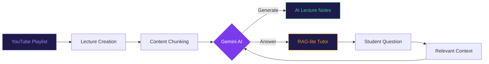
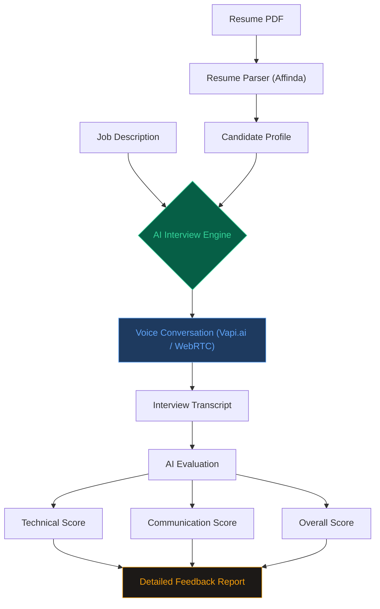
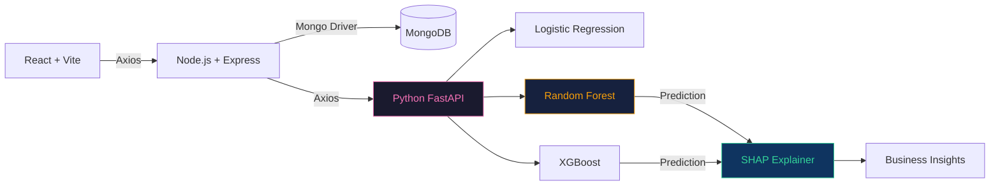
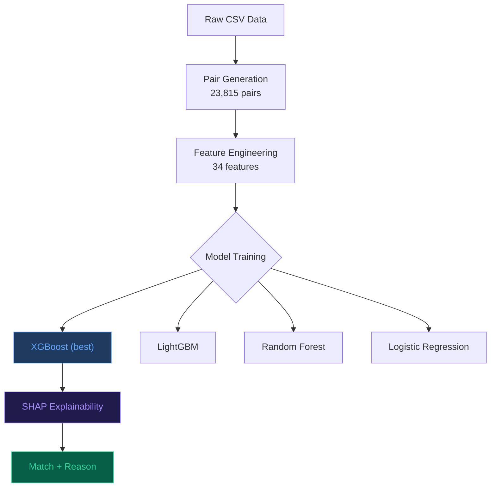
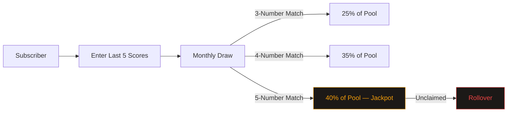
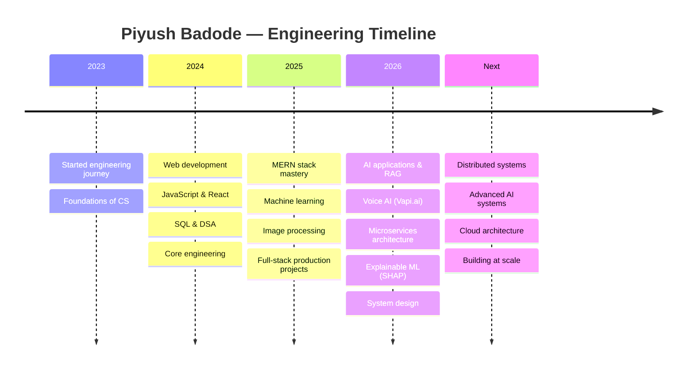

<div align="center">


<a href="https://git.io/typing-svg">
  
</a>

<br/>

<a href="https://github.com/Piyush6046">
  
</a>
&nbsp;
<a href="https://github.com/Piyush6046?tab=repositories">
  
</a>
&nbsp;


</div>

<br/>

## About

```typescript
const piyush: Developer = {
  name        : "Piyush Badode",
  college     : "VJTI Mumbai — Information Technology",
  role        : ["Full-Stack Engineer", "AI/ML Builder", "System Designer"],
  languages   : ["C++", "TypeScript", "JavaScript", "Python", "SQL"],
  currentStack: {
    backend   : ["Node.js", "Express", "FastAPI", "Flask"],
    frontend  : ["React", "Vite", "Redux Toolkit", "Tailwind CSS"],
    database  : ["MongoDB", "MySQL"],
    ai_ml     : ["Gemini", "OpenAI", "Vapi.ai", "XGBoost", "SHAP", "RAG"],
    cloud     : ["Vercel", "Render", "MongoDB Atlas", "Cloudinary"],
    payments  : ["Razorpay"],
  },
  mindset     : "Problem → Architecture → Data Flow → Scale",
  philosophy  : "Build for the problem, not for the technology",
  currentlyExploring: ["Advanced RAG", "Agentic AI", "Distributed Systems", "MLOps", "Redis"],
};
```

> *"I don't build pages. I build systems — where data flows, AI reasons, and scale is a design decision."*

<br/>

## Engineering Universe

<div align="center">

| Full-Stack | AI / ML | Systems | CS Fundamentals |
|:---|:---|:---|:---|
| React / Vite | Generative AI | Microservices | Data Structures |
| Node.js / Express | RAG Pipelines | FastAPI / Flask | Algorithms & DP |
| MongoDB / MySQL | LLM Applications | API Architecture | DBMS / SQL |
| Redux Toolkit | Gemini / OpenAI | Database Design | OOP Principles |
| JWT / Cookies | Vapi.ai (Voice AI) | Caching Strategies | OS / CN |
| Razorpay | XGBoost / RF / LR | Webhooks | System Design |
| Cloudinary | SHAP Explainability | Authentication | Problem Solving |
| REST API Design | Scikit-learn | Deployment Pipelines | Software Engineering |

</div>

<br/>

## Technology Arsenal

**Languages**
<br/>


**Backend**
<br/>


**Frontend**
<br/>


**Database & Cloud**
<br/>


**AI / ML**
<br/>


**Tools**
<br/>


<br/>

## Featured Projects

---

### 01 — InstructoPlus | AI-Powered LMS

> **AI-Powered MERN Learning Management System** — full-stack LMS with AI-generated lecture notes, an AI tutor over ingested course content, YouTube-based lecture creation, and a complete payments pipeline.



**Payment flow:** `Client → Create Order → Backend → Razorpay → HMAC-SHA256 Signature Verification → Confirmed`

**Data design:** compound index `(userId, courseId)` prevents duplicate course-progress records.

| Layer | Technology |
|---|---|
| Frontend | React + Vite |
| Backend | Node.js + Express |
| Auth | JWT + httpOnly Cookies |
| AI | Gemini + RAG-lite |
| Queues | Redis + BullMQ (email) |
| Payment | Razorpay + server-side verification |
| Storage | MongoDB + Cloudinary |
| Deploy | Vercel + Render + MongoDB Atlas + Docker |

<div align="center">


</div>

**Repo:** [InstructoPlus](https://github.com/Piyush6046/InstructoPlus)

---

### 02 — UniBuddy | AI Student Ecosystem

> **AI-Powered Student Ecosystem** — a single platform for campus life, academics, career prep and student services, built around a voice-driven AI mock interviewer.



**Campus ecosystem modules**

| Module | Purpose |
|---|---|
| AI Mock Interviewer | Voice-to-voice placement prep with resume-aware questions |
| Hostel Management | Campus accommodation |
| Food Discovery | Canteen / food services |
| Mentorship | Senior / alumni connections |
| Marketplace | Student book exchange |
| Pointer Helper | SGPA/CGPA tracking + target prediction |
| Admin Panel | Platform management |

<div align="center">


</div>

**Repo:** [UniBuddy-Deployment](https://github.com/Piyush6046/UniBuddy-Deployment)

---

### 03 — TeleRetain | Churn Prediction SaaS

> **AI-Powered Telecom Customer Retention Platform** — full-stack SaaS predicting churn with an ML ensemble, and turning predictions into explainable retention decisions via SHAP.



**Model leaderboard**

| Model | ROC-AUC | F1 | Precision | Recall |
|---|---|---|---|---|
| Random Forest (deployed) | **0.85** | **0.65** | **0.56** | **0.78** |
| Logistic Regression | 0.86 | 0.64 | 0.52 | 0.84 |
| XGBoost | 0.85 | 0.63 | 0.55 | 0.75 |

**Explainable AI** — instead of just `Churn = 82%`, the system answers *why*:

```
Contract Duration    ─────────────────►  HIGH RISK   (+++)
Monthly Charges      ──────────────►    RISK         (++)
Tenure                ◄────────────      PROTECTION   (--)
Support Services      ◄───────────       PROTECTION   (--)
```

<div align="center">


</div>

**Repo:** [TeleRetain](https://github.com/Piyush6046/TeleRetain)

---

### 04 — TradePlus AI | Intelligent Trade Matchmaking

> **Intelligent Import–Export Matchmaking** — an ML pipeline generating 23,815 exporter–importer pairs, engineering 34 features, and producing explainable match scores with XGBoost + SHAP. Built at LOC Hackathon (top 5 of ~30 teams, team of four, two-day build).



**Best model — XGBoost**

```
ROC-AUC       →  0.9802
Accuracy      →  97.63%
Precision     →  97.96%
Recall        →  99.55%
F1 Score      →  0.9875
5-Fold AUC    →  0.9755 ± 0.0047
```

**Feature engineering covers:** capacity ratio, geographic alignment, trade corridors, logistics compatibility, regulatory alignment, payment terms, hiring signals, tariff exposure, geopolitical and war risk.

**Architecture:** `React → Node.js API → Feature Builder → Python Flask ML → XGBoost + SHAP → Match + Explanation`

<div align="center">


</div>

**Repo:** [tradeplus-ai](https://github.com/Piyush6046/tradeplus-ai)

---

### 05 — VAPT | Web Application Security

> **Vulnerability Assessment & Penetration Testing** — looking at applications not just as *"how do I build it?"* but *"how can this system fail, and how do I protect it?"*

| Domain | Focus Area |
|---|---|
| Authentication | Access control, session management |
| Authorization | Privilege escalation, role violations |
| Injection | SQLi, XSS, command injection |
| Input Validation | Boundary conditions, type coercion |
| HMAC / Signature | Cryptographic verification |

**Repo:** [VAPT](https://github.com/Piyush6046/VAPT)

---

### 06 — Digital Heroes | Golf Charity Platform

> **Subscription + Golf Scores + Monthly Draw + Charity + Admin** — a full-stack product specification for a charity lottery system with golf-handicap logic.



**Admin capabilities:** users, subscriptions, draw configuration, draw simulation, charity management, winner verification, payouts, analytics.

<br/>

## Other Builds

<div align="center">

| Project | Focus | Stack |
|---|---|---|
| **Quiz App** | Interactive quiz platform | HTML / CSS / JS |
| **VJTI Books** | Student book platform | JavaScript |
| **Movie Management** | Movie/show booking & billing | MySQL |
| **Online Library** | Library management system | Web |
| **SGPA Calculator** | Academic grade predictor | TypeScript |
| **Image Denoising** | Image processing / ML | Python |
| **GameZone** | Browser gaming platform | HTML |
| **Portfolio** | Personal portfolio site | HTML / CSS |

</div>

<br/>

## Engineering Principles

| Principle | Description |
|:---|---|
| **Problem First** | *What is the problem?* always precedes *what technology should I use?* |
| **Separation of Concerns** | Frontend ↔ API Layer ↔ Business Logic ↔ Database ↔ AI/ML Services |
| **Explainable AI** | `Prediction + Reason + Evidence` beats `Prediction only` |
| **Beyond the Happy Path** | Auth failures, payment verification, API fallbacks, model failures, scale |
| **Data-Driven Design** | Schema, indexing, and compound constraints are first-class decisions |
| **Build for Scale** | Every design decision considers what happens when the system grows |

```text
IDEA → PROBLEM → REQUIREMENTS → ARCHITECTURE → [FRONTEND · BACKEND · DATA/AI] → TEST → DEPLOY → SCALE
```

<br/>

## Developer Journey



<br/>

## GitHub Analytics

<div align="center">


<br/><br/>


<br/><br/>


</div>

<br/>

## Contribution Activity

<div align="center">

<picture>
  <source media="(prefers-color-scheme: dark)" srcset="https://raw.githubusercontent.com/Piyush6046/Piyush6046/output/github-contribution-grid-snake-dark.svg"/>
  <source media="(prefers-color-scheme: light)" srcset="https://raw.githubusercontent.com/Piyush6046/Piyush6046/output/github-contribution-grid-snake.svg"/>
  
</picture>

</div>

<br/>

## Currently Exploring

<div align="center">

| Area | Focus |
|:---|:---|
| Advanced RAG | Building smarter retrieval systems |
| Agentic AI | Multi-step autonomous LLM agents |
| Distributed Systems | CAP theorem, consistency patterns |
| Redis & Caching | Pub/sub, sessions, rate limiting |
| Cloud Architecture | IaC, serverless, edge computing |
| App Security | Threat modeling, secure SDLC |
| MLOps | Model versioning, drift detection |
| Docker & Kubernetes | Container orchestration at scale |

</div>

<br/>

## Featured Repositories

<div align="center">

<a href="https://github.com/Piyush6046/UniBuddy-Deployment">
  
</a>
<a href="https://github.com/Piyush6046/InstructoPlus">
  
</a>

<br/><br/>

<a href="https://github.com/Piyush6046/TeleRetain">
  
</a>
<a href="https://github.com/Piyush6046/tradeplus-ai">
  
</a>

<br/><br/>

<a href="https://github.com/Piyush6046/VAPT">
  
</a>

</div>

<br/>

<div align="center">

## Let's Connect

<a href="https://github.com/Piyush6046">
  
</a>

<br/><br/>


<br/>

**Thanks for visiting — if something here resonated, leave a star on a repo that helped you.**


</div>
